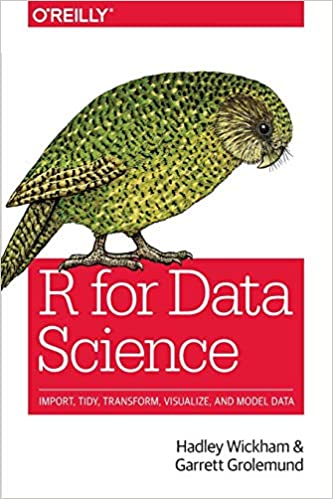
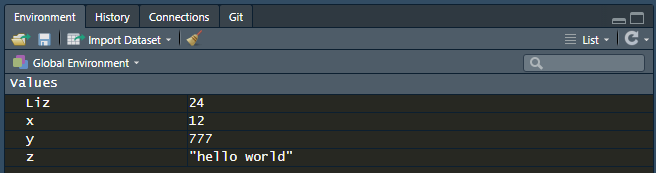
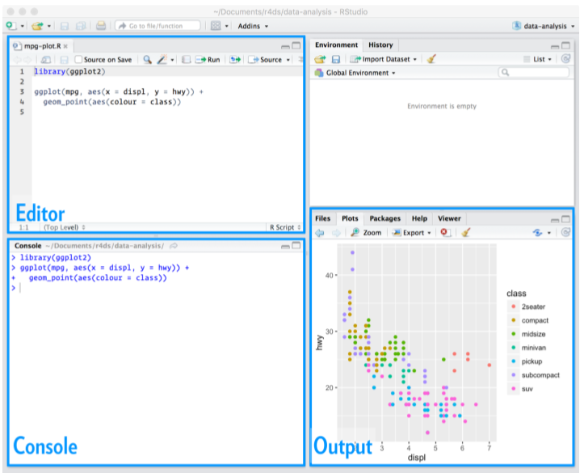
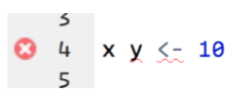
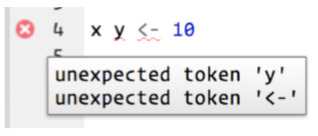
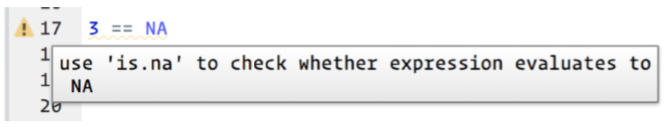
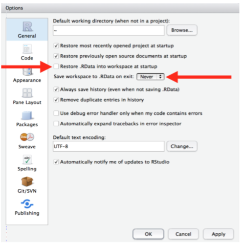
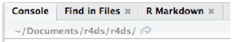

# Summary

- **Introdution R**
- **R for Data Science**
- **Workflow: Basics**
  - Coding Basics 
  - What’s in a Name? 
  - Calling Functions 
- **Workflow: Scripts**
  - Running Code 
  - RStudio Diagnostics
- **Workflow: Projects**
  - What Is Real? 
  - Where Does Your Analysis Live? 
---
class: middle

# Introdution R

---
## Criadores

<center><center>

_Ross Ihaka e  Robert Gentleman_

--

- O nome R provém em parte das iniciais dos criadores (Ross e Robert) e também de um jogo figurado com a linguagem S.

---
class: middle

# R for Data Science

---
class: middle

.center[]

---
class: middle

## Part I: Explore

### Chapters: Workflow

- **2 Basic..............................................................................................................................37**

- **4 Script.............................................................................................................................77**

- **6 Projects........................................................................................................................111**

---
class: middle

# Workflow: Basics

---

- A frustração é natural quando você começa a programar em R;

--
- Típico e temporário: acontece com **todos**;

--
- A única maneira de superar isso é continuar **tentando**;

--
- Erro? _"O google é meu pastor é nada me faltará"_ **`-Cassol (2020)`**

--
## Coding Basics

--
- Você pode usar R como uma calculadora:

```{r}
1+1 #> [1] 2

1 / 200 * 30 #> [1] 0.15 

(59 + 73 + 2) / 3 #> [1] 44.7

sin(pi / 2) #> [1] 1 

```
---
- Você pode criar novos objetos com <-:
--

  - “O nome do objeto obtém tal valor”;

--
  - Não seja preguiçoso e use **`=`**;
```{r}

x <- 3 * 4 # environment e values

y <- 777

Liz <- 24

```

--
## What’s in a Name? 

--
- Os nomes dos **objetos devem começar com uma letra** e podem **conter apenas `letras`, `números`, `_` e `.`**;

--
- "Eu recomendo `snake_case`, onde você separa palavras em minúsculas com `_` ";

---
- Você pode inspecionar um objeto digitando seu nome:
```{r}
x
y 
Liz
```

--
## Calling Functions

- R tem uma grande coleção de funções integradas que são chamadas assim:

```{r}
#`function_name`(arg1 = val1, arg2 = val2, ...) 
```

---

- Vamos tentar usar seq (), que cria **seq**uências regulares de números e, enquanto estamos nisso, aprenderemos mais recursos úteis do RStudio:

```{r}
seq(1, 10)

#seq(1, 10

```

- Digite este código e observe a ajuda de assistência semelhante:

```{r}
z <- "hello world"

#z <- "hello 
```

  - As aspas e parênteses devem sempre vir em par;
  
- Agora observe o seu ambiente no painel superior direito:



---
class: middle

# Workflow: Scripts

---
- Console: é um ótimo lugarpara começar;

--
- Gráficos ggplot2 e canais dplyr mais complexos; 

--


---
class: middle

- Como Abrir um R Script? 

  1. File ➔ New File ➔ R script;

  2. Ctrl-Shift-N;

## Running Code

- Script editor:
  - ENTER + CTRL # assim roda o comando no scrit, diferente do console que é só ENTER.

---

### RStudio Diagnostics 

- O editor de script também destacará os erros;

--



```{r, echo=FALSE}
#x y <- 10
```

--

- Passe o mouse sobre o `x` para ver qual o problema:

--



--
- O RStudio também informará sobre problemas em potencial:

--



---

class: middle

# Workflow: Projects

---

- Um dia você precisará sair do R.
- fazer outra coisa e voltar para sua análise no dia seguinte.
- Um dia você estará trabalhando em várias analises simultaneamente.
- Um dia você precisará trazer dados de fora do mundo R e enviar resultados numéricos e números de R de volta para o mundo.

  - Para lidar com essas situações da vida real, você precisatome duas decisões:

  1. E a sua análise é "real", ou seja, o que você salvará como seu registro duradouro do que aconteceu?

  2. Onde sua análise “mora”?

### What Is Real?

- Como um usuário R iniciante, não há problema em considerar seu Environment (ou seja,os objetos listados no painel de "ambiente") “real”. No entanto, ao longo prazo, você ficará muito melhor se considerar seus scripts R como `"real"`.
- Com seus scripts R (e seus arquivos de dados), você pode recriar o ambiente/ronment.
  
---

- Para promover este comportamento, eu recomendo fortemente que você instrua RStudio para não preservar seu espaço de trabalho entre as sessões: 

--
<center>Toold ➔ Global Options.<center>

--

<center><center>

---
- Where Does Your Analysis Live? 

  - R tem uma noção poderosa do working directory (diretório de trabalho).

  - É aqui que R procura os arquivos que você pede para carregar e onde colocará os arquivosque você pede para salvar. O RStudio mostra sua direção de trabalho atualhistória na parte superior do console:

<center>

ou 

E você pode imprimir isso no código R executando `getwd ()`:
```{r}
getwd() 
```

---
### OK, sei aonde está... e para mudar? 

```{r, eval=FALSE}
setwd()
```

--
## Summary 

- Em resumo, os projetos RStudio oferecem um fluxo de trabalho sólido que atendê-lo bem no futuro:
- Crie um projeto RStudio para cada projeto de análise de dados.
- Mantenha os arquivos de dados lá; falaremos sobre como carregá-los no R no Capítulo 8 .
- Mantenha os scripts lá; edite-os e execute-os em bits ou como umtodo.
- Salve seus resultados (gráficos e dados limpos) lá.• Sempre use caminhos relativos, não caminhos absolutos.

Tudo o que você precisa está em um só lugar e separado de todos osos outros projetos nos quais você está trabalhando

---
class: middle, center

#LINKS

[Xaringan Presentations](https://bookdown.org/yihui/rmarkdown/xaringan.html)

[Apresentações no R](https://beatrizmilz.github.io/aMostra-IME-2019-Xaringan/#1)


---
class: middle, center

# `OBRIGADA!!`

  